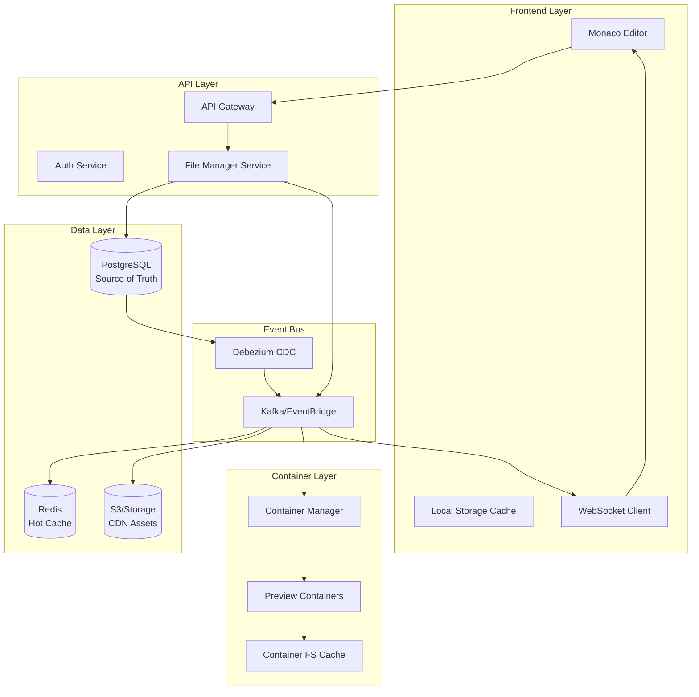

# File System Synchronization Architecture Recommendation
## Velocity Platform - Long-term Scalable Solution

---

## Executive Summary

After comprehensive analysis of the current implementation and future scaling requirements, I recommend adopting an **Event-Driven Architecture with Intelligent Caching** that uses the database as the source of truth, implements smart container initialization, and leverages edge computing for optimal performance.

This approach will support:
- **100,000+ concurrent preview sessions**
- **Sub-100ms file update propagation**
- **Full version control and rollback capabilities**
- **Multi-region deployment**
- **Enterprise-grade reliability**

---

## Architectural Options Analysis

### Option 1: Database-Centric Architecture
**Approach**: All files stored in PostgreSQL, containers query directly

**Pros:**
- Single source of truth
- ACID compliance for all operations
- Built-in version control with PostgreSQL
- Rich querying capabilities
- Excellent for collaborative features

**Cons:**
- Database becomes bottleneck at scale
- Higher latency for file reads (5-20ms per file)
- Connection pool limitations (100-500 concurrent)
- Not optimal for binary assets

**Scale Limit**: ~1,000 concurrent containers

---

### Option 2: Storage-First Architecture
**Approach**: Supabase Storage as primary, database for metadata

**Pros:**
- CDN-ready for global distribution
- Optimized for binary files
- Lower database load
- Direct streaming capabilities
- S3-compatible APIs

**Cons:**
- No built-in versioning
- Complex rollback scenarios
- Eventual consistency issues
- Limited querying capabilities
- Separate sync mechanism needed

**Scale Limit**: ~10,000 concurrent containers (with CDN)

---

### Option 3: Hybrid Synchronized Architecture
**Approach**: Database for code, Storage for assets, bidirectional sync

**Pros:**
- Optimized for different file types
- Good performance characteristics
- Flexible deployment options

**Cons:**
- Complex synchronization logic
- Potential for split-brain scenarios
- Difficult debugging and monitoring
- Higher operational overhead
- Race conditions in concurrent edits

**Scale Limit**: ~5,000 concurrent containers (complexity limited)

---

### Option 4: Event-Driven Architecture with Intelligent Caching ⭐ RECOMMENDED
**Approach**: Database as source of truth, event-driven propagation, multi-layer caching

**Pros:**
- Infinitely scalable through event streaming
- Sub-100ms update propagation
- Resilient to failures
- Support for offline editing
- Natural audit trail
- Easy to add new consumers
- Perfect for microservices evolution

**Cons:**
- Higher initial complexity
- Requires message broker infrastructure
- Eventually consistent by design

**Scale Limit**: 100,000+ concurrent containers

---

## Recommended Architecture: Event-Driven with Intelligent Caching

### Core Components



### Detailed Architecture

#### 1. Write Path (User Edits)
```typescript
// Frontend: Optimistic updates with conflict resolution
class FileSystemSync {
  async saveFile(path: string, content: string) {
    // 1. Optimistic local update
    await this.localCache.set(path, content);
    this.updateUI(path, content);
    
    // 2. Send to API with idempotency key
    const operation = {
      id: uuid(),
      type: 'file.update',
      path,
      content,
      checksum: sha256(content),
      timestamp: Date.now(),
      userId: this.userId,
      sessionId: this.sessionId
    };
    
    // 3. Persist to database via API
    const result = await api.post('/files/save', operation);
    
    // 4. Handle conflicts if any
    if (result.conflict) {
      return this.resolveConflict(result.conflict);
    }
    
    // 5. Confirm local cache
    await this.localCache.confirm(path, result.version);
  }
}
```

#### 2. Event Processing Pipeline
```typescript
// Backend: Event processor for file changes
class FileEventProcessor {
  async processFileChange(event: FileChangeEvent) {
    // 1. Validate event
    if (!this.validateChecksum(event)) {
      throw new ChecksumMismatchError();
    }
    
    // 2. Update caches in parallel
    await Promise.all([
      this.updateRedisCache(event),
      this.updateCDNStorage(event),
      this.invalidateEdgeCache(event)
    ]);
    
    // 3. Broadcast to interested parties
    await this.eventBus.publish({
      topic: `project.${event.projectId}.files`,
      event: {
        type: 'file.updated',
        path: event.path,
        version: event.version,
        checksum: event.checksum,
        author: event.userId,
        timestamp: event.timestamp
      }
    });
    
    // 4. Trigger dependent services
    await Promise.all([
      this.triggerAIIndexing(event),
      this.triggerLinting(event),
      this.triggerBackup(event)
    ]);
  }
}
```

#### 3. Container Initialization (Optimized Cold Start)
```typescript
// Container: Smart initialization with progressive loading
class ContainerFileSystem {
  async initialize(projectId: string, sessionId: string) {
    // 1. Load manifest from Redis (cached project structure)
    const manifest = await redis.get(`project:${projectId}:manifest`);
    
    // 2. Parallel load critical files (package.json, main entry points)
    const criticalFiles = await this.loadCriticalFiles(manifest);
    
    // 3. Start dev server with critical files
    this.startDevServer(criticalFiles);
    
    // 4. Progressive load remaining files in background
    this.progressiveLoad(manifest, criticalFiles);
    
    // 5. Subscribe to real-time updates
    this.subscribeToUpdates(projectId, sessionId);
    
    // 6. Prebuild and cache common dependencies
    await this.prebuildDependencies(manifest);
  }
  
  private async loadCriticalFiles(manifest: ProjectManifest) {
    // Load only files needed for initial render
    const critical = manifest.files.filter(f => 
      f.path.match(/^(package\.json|tsconfig|index\.|app\.|main\.)/i)
    );
    
    // Batch load from Redis with fallback to database
    const files = await this.batchLoad(critical.map(f => f.path));
    
    // Write to container filesystem
    await this.writeFiles(files);
    
    return files;
  }
}
```

#### 4. Real-time Synchronization
```typescript
// Real-time sync with intelligent diffing
class RealtimeFileSync {
  private pendingOps = new Map<string, Operation>();
  private websocket: WebSocket;
  
  async handleUpdate(event: FileUpdateEvent) {
    // 1. Check if we have pending local changes
    if (this.pendingOps.has(event.path)) {
      return this.mergeWithPending(event);
    }
    
    // 2. Apply incremental diff (not full file)
    const diff = await this.computeDiff(event);
    
    // 3. Apply to local filesystem
    await this.applyDiff(diff);
    
    // 4. Hot reload if applicable
    if (this.shouldHotReload(event.path)) {
      await this.triggerHotReload(event.path);
    }
  }
  
  private async mergeWithPending(event: FileUpdateEvent) {
    // Operational transformation for conflict-free merges
    const pending = this.pendingOps.get(event.path);
    const merged = this.operationalTransform(pending, event);
    
    await this.applyMerged(merged);
    this.pendingOps.delete(event.path);
  }
}
```

### Data Models

#### PostgreSQL Schema (Enhanced)
```sql
-- Main file table with built-in versioning
CREATE TABLE project_files (
    id UUID PRIMARY KEY DEFAULT gen_random_uuid(),
    project_id UUID NOT NULL REFERENCES projects(id),
    file_path TEXT NOT NULL,
    content TEXT,
    content_hash VARCHAR(64) NOT NULL, -- SHA-256 for deduplication
    file_size INTEGER NOT NULL,
    mime_type VARCHAR(255),
    encoding VARCHAR(32) DEFAULT 'utf8',
    
    -- Version control
    version INTEGER NOT NULL DEFAULT 1,
    parent_version_id UUID REFERENCES project_files(id),
    is_current BOOLEAN DEFAULT true,
    
    -- Metadata
    created_by UUID NOT NULL REFERENCES users(id),
    created_at TIMESTAMPTZ NOT NULL DEFAULT NOW(),
    updated_at TIMESTAMPTZ NOT NULL DEFAULT NOW(),
    
    -- Performance optimization
    is_binary BOOLEAN DEFAULT false,
    is_generated BOOLEAN DEFAULT false,
    last_accessed_at TIMESTAMPTZ,
    access_count INTEGER DEFAULT 0,
    
    -- Constraints
    CONSTRAINT unique_current_file UNIQUE(project_id, file_path, is_current) WHERE is_current = true
);

-- Indexes for performance
CREATE INDEX idx_files_project_current ON project_files(project_id) WHERE is_current = true;
CREATE INDEX idx_files_content_hash ON project_files(content_hash);
CREATE INDEX idx_files_hot ON project_files(project_id, last_accessed_at DESC) WHERE access_count > 10;

-- File operations audit log
CREATE TABLE file_operations (
    id UUID PRIMARY KEY DEFAULT gen_random_uuid(),
    operation_id UUID NOT NULL, -- Idempotency key
    project_id UUID NOT NULL,
    file_id UUID REFERENCES project_files(id),
    operation_type VARCHAR(50) NOT NULL, -- create, update, delete, rename, move
    operation_data JSONB NOT NULL,
    user_id UUID NOT NULL,
    session_id UUID,
    ip_address INET,
    user_agent TEXT,
    created_at TIMESTAMPTZ NOT NULL DEFAULT NOW(),
    
    CONSTRAINT unique_operation UNIQUE(operation_id)
);

-- Trigger for CDC (Change Data Capture)
CREATE OR REPLACE FUNCTION notify_file_change() RETURNS TRIGGER AS $$
BEGIN
    PERFORM pg_notify(
        'file_changes',
        json_build_object(
            'operation', TG_OP,
            'project_id', NEW.project_id,
            'file_path', NEW.file_path,
            'version', NEW.version,
            'checksum', NEW.content_hash,
            'timestamp', NOW()
        )::text
    );
    RETURN NEW;
END;
$$ LANGUAGE plpgsql;

CREATE TRIGGER file_change_notification
    AFTER INSERT OR UPDATE ON project_files
    FOR EACH ROW
    WHEN (NEW.is_current = true)
    EXECUTE FUNCTION notify_file_change();
```

#### Redis Cache Structure
```typescript
// Redis cache layers for different access patterns
interface CacheStructure {
  // Hot files cache (TTL: 1 hour)
  "file:<project_id>:<path>": {
    content: string;
    version: number;
    checksum: string;
    lastModified: number;
  };
  
  // Project manifest (TTL: 5 minutes)
  "manifest:<project_id>": {
    files: Array<{
      path: string;
      size: number;
      checksum: string;
      isDirectory: boolean;
    }>;
    dependencies: Record<string, string>;
    lastSync: number;
  };
  
  // Container registry (TTL: 30 minutes)
  "containers:<project_id>": Set<string>; // Active container IDs
  
  // User session files (TTL: 2 hours)
  "session:<session_id>:files": {
    openFiles: string[];
    recentFiles: string[];
    unsavedChanges: Record<string, string>;
  };
}
```

### Performance Optimizations

#### 1. Container Cold Start Optimization
```typescript
class ContainerOptimizer {
  // Pre-warm containers for active users
  async preWarmContainers() {
    const activeUsers = await this.getActiveUsers();
    
    for (const user of activeUsers) {
      const project = await this.getMostRecentProject(user.id);
      if (this.shouldPreWarm(project)) {
        await this.warmContainer(project.id);
      }
    }
  }
  
  // Snapshot and restore for instant starts
  async createSnapshot(projectId: string) {
    const container = await this.getHealthyContainer(projectId);
    const snapshot = await container.createSnapshot();
    
    await this.storage.save(`snapshots/${projectId}`, snapshot);
    return snapshot.id;
  }
  
  async restoreFromSnapshot(snapshotId: string) {
    const snapshot = await this.storage.get(`snapshots/${snapshotId}`);
    return this.flyio.createMachineFromSnapshot(snapshot);
  }
}
```

#### 2. Intelligent File Bundling
```typescript
class FileBundler {
  // Bundle related files for efficient transfer
  async createBundle(projectId: string, pattern: string) {
    const files = await this.getFiles(projectId, pattern);
    
    // Group by likelihood of co-access
    const bundles = this.intelligentGrouping(files);
    
    // Compress and cache bundles
    return Promise.all(bundles.map(bundle => 
      this.compressAndCache(bundle)
    ));
  }
  
  private intelligentGrouping(files: ProjectFile[]) {
    // Group by:
    // 1. Import relationships
    // 2. Directory proximity
    // 3. Historical co-access patterns
    // 4. File type similarity
    
    const graph = this.buildDependencyGraph(files);
    return this.communityDetection(graph);
  }
}
```

#### 3. Differential Sync Protocol
```typescript
class DifferentialSync {
  // Only sync changes, not entire files
  async syncChanges(localVersion: number, remoteVersion: number) {
    const operations = await this.getOperations(localVersion, remoteVersion);
    
    // Apply operational transforms
    const transformed = this.transformOperations(operations);
    
    // Apply in order
    for (const op of transformed) {
      await this.applyOperation(op);
    }
    
    return remoteVersion;
  }
  
  private transformOperations(ops: Operation[]) {
    // Implement Operational Transformation (OT) algorithm
    // for conflict-free concurrent editing
    return this.operationalTransform(ops);
  }
}
```

### Scalability Considerations

#### 1. Multi-Region Deployment
```yaml
# Infrastructure as Code (Terraform/Pulumi)
regions:
  us-east-1:
    database: primary
    cache: primary
    containers: 1000
    cdn: enabled
  
  eu-west-1:
    database: read-replica
    cache: regional
    containers: 500
    cdn: enabled
  
  ap-southeast-1:
    database: read-replica
    cache: regional
    containers: 300
    cdn: enabled

replication:
  strategy: async
  lag_threshold: 100ms
  failover: automatic
```

#### 2. Load Distribution
```typescript
class LoadBalancer {
  async routeRequest(request: Request) {
    // 1. Geo-routing for lowest latency
    const region = this.getClosestRegion(request.ip);
    
    // 2. Check container availability
    const container = await this.findAvailableContainer(
      request.projectId,
      region
    );
    
    if (!container) {
      // 3. Spin up new container if needed
      return this.createContainer(request.projectId, region);
    }
    
    // 4. Route to container
    return this.route(request, container);
  }
}
```

### Security Considerations

#### 1. File Access Control
```typescript
class FileAccessControl {
  async checkAccess(userId: string, fileId: string, operation: string) {
    // Row-level security in PostgreSQL
    const permission = await this.db.query(`
      SELECT can_access FROM file_permissions
      WHERE user_id = $1 AND file_id = $2 AND operation = $3
    `, [userId, fileId, operation]);
    
    if (!permission) {
      // Check project-level permissions
      return this.checkProjectAccess(userId, fileId, operation);
    }
    
    return permission.can_access;
  }
}
```

#### 2. Encryption at Rest and in Transit
```typescript
class EncryptionService {
  // Encrypt sensitive files
  async encryptFile(content: string, projectId: string) {
    const key = await this.getProjectKey(projectId);
    return crypto.encrypt(content, key);
  }
  
  // End-to-end encryption for enterprise
  async e2eEncrypt(content: string, publicKey: string) {
    return crypto.publicEncrypt(publicKey, content);
  }
}
```

### Monitoring and Observability

#### 1. Key Metrics
```typescript
interface FileSystemMetrics {
  // Performance metrics
  avgSyncLatency: number;        // Target: <100ms
  p99SyncLatency: number;        // Target: <500ms
  containerColdStart: number;    // Target: <3s
  fileLoadTime: number;          // Target: <50ms per file
  
  // Reliability metrics
  syncSuccessRate: number;       // Target: >99.9%
  conflictRate: number;          // Target: <0.1%
  dataLossIncidents: number;     // Target: 0
  
  // Scale metrics
  concurrentContainers: number;
  activeProjects: number;
  filesPerSecond: number;
  totalStorageGB: number;
}
```

#### 2. Distributed Tracing
```typescript
class TracingService {
  async traceFileOperation(operation: FileOperation) {
    const span = this.tracer.startSpan('file.operation');
    
    span.setAttributes({
      'file.path': operation.path,
      'file.size': operation.size,
      'user.id': operation.userId,
      'project.id': operation.projectId
    });
    
    try {
      const result = await operation.execute();
      span.setStatus({ code: SpanStatusCode.OK });
      return result;
    } catch (error) {
      span.recordException(error);
      span.setStatus({ code: SpanStatusCode.ERROR });
      throw error;
    } finally {
      span.end();
    }
  }
}
```

---

## Implementation Roadmap

### Phase 1: Foundation (Week 1-2)
1. **Fix immediate storage mismatch**
   - Implement database-to-container file transfer
   - Add basic real-time broadcasting
   - Ensure files persist across container restarts

2. **Add event bus infrastructure**
   - Set up PostgreSQL LISTEN/NOTIFY
   - Implement basic CDC with Debezium
   - Create event processing service

### Phase 2: Caching Layer (Week 3-4)
1. **Implement Redis caching**
   - Hot file caching
   - Project manifest caching
   - Session-based file caching

2. **Container optimization**
   - Implement progressive file loading
   - Add dependency pre-building
   - Create container pooling system

### Phase 3: Real-time Sync (Week 5-6)
1. **WebSocket infrastructure**
   - Bidirectional file sync
   - Operational transformation
   - Conflict resolution

2. **Differential sync**
   - Implement diff algorithms
   - Add incremental updates
   - Create rollback mechanism

### Phase 4: Scale and Performance (Week 7-8)
1. **Multi-region support**
   - Database replication setup
   - CDN integration
   - Geo-routing implementation

2. **Performance optimization**
   - Container snapshots
   - File bundling
   - Predictive pre-warming

### Phase 5: Enterprise Features (Week 9-10)
1. **Advanced security**
   - End-to-end encryption
   - Audit logging
   - Compliance features

2. **Monitoring and observability**
   - Comprehensive metrics
   - Distributed tracing
   - Performance dashboards

---

## Cost Analysis

### Estimated Monthly Costs at Scale

#### 10,000 Active Projects
- **Database (PostgreSQL)**: $500 (db.r6g.xlarge with replicas)
- **Redis Cache**: $300 (cache.r6g.large cluster)
- **Storage (S3)**: $200 (10TB with CDN)
- **Containers (Fly.io)**: $2,000 (shared-cpu-1x)
- **Event Bus**: $150 (managed Kafka/EventBridge)
- **Monitoring**: $200 (Datadog/New Relic)
- **Total**: ~$3,350/month

#### 100,000 Active Projects
- **Database**: $3,000 (db.r6g.4xlarge cluster)
- **Redis**: $2,000 (cache.r6g.xlarge cluster)
- **Storage**: $2,000 (100TB with global CDN)
- **Containers**: $15,000 (mixed shared/dedicated)
- **Event Bus**: $1,000 (Kafka cluster)
- **Monitoring**: $1,500
- **Total**: ~$24,500/month

---

## Risk Mitigation

### Technical Risks
1. **Data Loss**
   - Mitigation: Multi-region backups, point-in-time recovery
   
2. **Sync Failures**
   - Mitigation: Retry mechanisms, dead letter queues
   
3. **Performance Degradation**
   - Mitigation: Auto-scaling, circuit breakers

### Operational Risks
1. **Complexity**
   - Mitigation: Comprehensive documentation, automation
   
2. **Vendor Lock-in**
   - Mitigation: Abstraction layers, standard protocols

---

## Conclusion

The **Event-Driven Architecture with Intelligent Caching** provides the best foundation for Velocity's long-term success. It offers:

1. **Unlimited scalability** through event streaming
2. **Sub-100ms performance** via intelligent caching
3. **Full version control** with PostgreSQL
4. **Global distribution** capability
5. **Enterprise-ready** security and reliability

While the initial implementation is more complex than simpler alternatives, the architecture will support Velocity's growth from startup to enterprise scale without requiring fundamental rewrites.

The modular design allows for incremental implementation, starting with basic functionality in Week 1-2 and progressively adding advanced features. This approach minimizes risk while ensuring each component is production-ready before moving to the next phase.

---

## Appendix: Technology Stack

### Core Technologies
- **Database**: PostgreSQL 15+ with pgvector
- **Cache**: Redis 7+ with RedisJSON
- **Storage**: S3-compatible (Supabase Storage/AWS S3)
- **Event Bus**: PostgreSQL LISTEN/NOTIFY → Kafka (at scale)
- **Containers**: Fly.io Machines
- **CDN**: Cloudflare/Fastly
- **Monitoring**: OpenTelemetry + Datadog/New Relic

### Development Tools
- **API Framework**: Node.js with Express/Fastify
- **WebSocket**: Socket.io/native WebSocket
- **Testing**: Jest + Playwright for E2E
- **CI/CD**: GitHub Actions
- **IaC**: Terraform/Pulumi

### Optional Enhancements
- **GraphQL**: For efficient file queries
- **gRPC**: For inter-service communication
- **NATS**: As lightweight message broker
- **Temporal**: For workflow orchestration