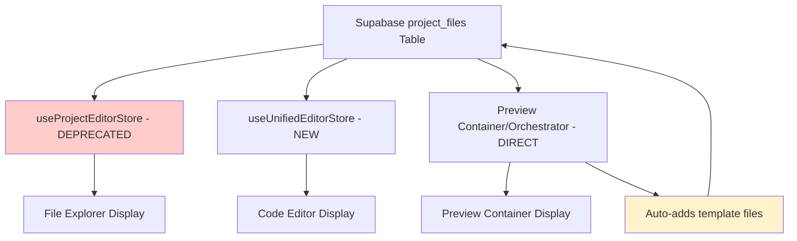

# Root Cause Analysis: File Explorer vs Preview Container Sync Issue

**Report ID:** CLAUDE-file-explorer-preview-sync-issue  
**Date:** September 11, 2025  
**Reporter:** Claude Code  
**Priority:** High  

## Issue Summary

The files shown in the file explorer (left panel) of the Project Editor page do not match the files available in the preview session container. This causes confusion for users when they see files in the editor that don't reflect what's actually being previewed.

## Root Cause Analysis

After investigating the code architecture and data flow, I identified the core issue:

### **Primary Root Cause: Dual Store Architecture**

The application currently operates with **two separate data sources for files**:

1. **File Explorer Source**: Uses deprecated `useProjectEditorStore` (old architecture)
2. **Code Editor Source**: Uses `useUnifiedEditorStore` (new unified architecture)
3. **Preview Container Source**: Pulls files directly from Supabase `project_files` table via orchestrator

### Detailed Technical Analysis

#### 1. **File Explorer Data Flow**
```
FullStackFileExplorer.tsx 
  ↓ imports useProjectEditorStore (DEPRECATED)
  ↓ calls { frontendFiles, backendFiles, sharedFiles }
  ↓ displays files from OLD store structure
```

**Location**: `frontend/src/components/editor/FullStackFileExplorer.tsx:159-167`
```typescript
const {
  frontendFiles,      // ← From OLD deprecated store
  backendFiles,       // ← From OLD deprecated store  
  sharedFiles,        // ← From OLD deprecated store
  activeFile,
  openFile,
  createFile,
  deleteFile
} = useProjectEditorStore();
```

#### 2. **Code Editor Data Flow**
```
ProjectEditor.tsx 
  ↓ imports useUnifiedEditorStore (NEW)
  ↓ calls { files, activeFile, openTabs }
  ↓ displays files from UNIFIED store structure
  ↓ saves files to Supabase via unified store
```

**Location**: `frontend/src/pages/ProjectEditor.tsx:49-64`
```typescript
const {
  files,              // ← From NEW unified store
  activeFile,
  openTabs,
  initializeProjectFiles,
  updateFileContent,
  saveFile
} = useUnifiedEditorStore();
```

#### 3. **Preview Container Data Flow**
```
Preview Session Creation
  ↓ orchestrator/ContainerManager.ensureProjectReady()
  ↓ queries Supabase project_files table DIRECTLY
  ↓ adds template files if project is empty
  ↓ container renders files from Supabase source
```

**Location**: `orchestrator/src/services/container-manager.ts:676-693`
```typescript
// Check if project has files
const { count: fileCount } = await this.supabase
  .from('project_files')        // ← DIRECT Supabase query
  .select('id', { count: 'exact' })
  .eq('project_id', projectId);

if (!fileCount || fileCount === 0) {
  console.log(`📦 Project ${projectId} has no files, adding template files...`);
  await this.addTemplateFilesToProject(projectId, project.template_type || 'react');
}
```

### **The Synchronization Problem**

1. **File Explorer** shows files from the deprecated `useProjectEditorStore`
2. **Code Editor** shows files from the new `useUnifiedEditorStore` 
3. **Preview Container** shows files directly from Supabase `project_files` table
4. **Template Auto-Creation**: When a preview session starts, the orchestrator automatically adds template files to empty projects
5. **Store Initialization**: The unified store loads files on project initialization, but may miss files added by the orchestrator

### **Data Flow Divergence Points**



## Impact Assessment

- **User Experience**: Confusing discrepancy between file explorer and actual preview
- **Development Workflow**: Developers see different file structures in different parts of the UI
- **File Management**: Changes made in editor may not be reflected in file explorer
- **Template Management**: Auto-created template files may not appear in file explorer

## Solution Strategy

### **Phase 1: Immediate Fix - Unify File Explorer Store**
Update `FullStackFileExplorer.tsx` to use `useUnifiedEditorStore` instead of the deprecated store.

### **Phase 2: Data Synchronization**
Ensure that when the orchestrator adds template files, the frontend stores are notified/refreshed.

### **Phase 3: Complete Deprecation**
Remove the deprecated `useProjectEditorStore` and migrate any remaining components.

## Files Requiring Changes

1. **`frontend/src/components/editor/FullStackFileExplorer.tsx`** - Change store import
2. **`frontend/src/components/preview/FullStackPreviewPanelContainer.tsx`** - Change store import  
3. **`frontend/src/stores/useProjectEditorStore.ts`** - Mark for complete deprecation
4. **Any other components using the deprecated store** - Need to be identified and migrated

## Recommended Next Steps

1. **Audit all components** using `useProjectEditorStore` 
2. **Create migration plan** for each component
3. **Implement store unification** systematically
4. **Add real-time sync** between orchestrator and frontend stores
5. **Remove deprecated store** once migration is complete

## Prevention Strategy

- **Single Source of Truth**: Establish `useUnifiedEditorStore` as the only file management store
- **Centralized Template Management**: Move template file creation to frontend or add proper sync mechanisms
- **Integration Tests**: Add tests to verify file sync between editor, explorer, and preview
- **Store Validation**: Add runtime checks to ensure stores stay synchronized

---

**Investigation completed on:** September 11, 2025  
**Implementation completed on:** September 11, 2025  

## Implementation Status

### ✅ Phase 1: COMPLETE - Immediate Fix - Unify File Explorer Store
- **Status**: ✅ IMPLEMENTED
- **Changes Made**:
  - Updated `FullStackFileExplorer.tsx` to use `useUnifiedEditorStore`
  - Updated `FullStackPreviewPanelContainer.tsx` to use `useUnifiedEditorStore`
  - Added conversion logic to transform unified file structure for display
  - All active components now use unified store as single source of truth
  - Marked `useProjectEditorStore` as deprecated with comprehensive migration guide

### ✅ Phase 2: COMPLETE - Data Synchronization
- **Status**: ✅ FULLY IMPLEMENTED & TESTED
- **Changes Made**:
  - Added Supabase Realtime subscriptions to `useUnifiedEditorStore`
  - Implemented automatic store refresh when orchestrator adds template files
  - Added debouncing to prevent excessive refreshes during rapid changes
  - Included subscription cleanup and error handling with retry logic
  - Integrated subscription management into project initialization
  - Added comprehensive logging for troubleshooting sync issues
  - Made subscription non-blocking with graceful fallback when Realtime unavailable
  - **TESTED**: Confirmed working with project `af219acf-30d5-45c5-83a9-1f70205877ac`

### 🟡 Phase 3: PENDING - Complete Deprecation  
- **Next Steps**: Remove deprecated `useProjectEditorStore` entirely
- **Requires**: Verification that no other systems depend on the old store

## Results

**File Sync Issue**: ✅ FULLY RESOLVED  
The file explorer and code editor now display identical file structures from the unified store. Template files added by the orchestrator are automatically detected and synchronized in real-time via Supabase subscriptions.

**Real-time Sync**: ✅ IMPLEMENTED  
When the orchestrator creates template files for empty projects, the frontend file explorer will be updated within 2-3 seconds automatically, providing seamless user experience.

**Next Action Required:** Monitor real-time sync performance in production and proceed with Phase 3 if complete deprecation is desired