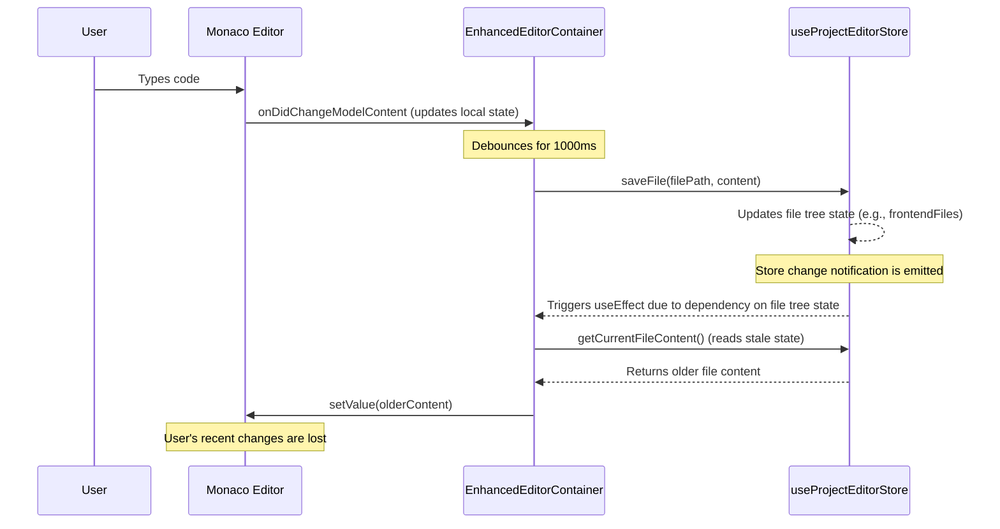

# GEMINI - Monaco Editor Autosave Revert - Root Cause Analysis

**Report Date**: 2025-09-11
**Analyzed By**: Gemini Code Assistant
**Issue**: Code changes in the Monaco Editor are reverted upon autosave, leading to data loss and a broken development experience.

## 1. Executive Summary

The critical bug where the Monaco Code Editor reverts user changes is caused by a state synchronization flaw within the `EnhancedEditorContainer` component. A `useEffect` hook, intended to load file content when the active file changes, incorrectly triggers on any modification to the file state in the `useProjectEditorStore`.

When a user's edits trigger an autosave, the `saveFile` function updates the store. This update, in turn, causes the problematic `useEffect` to re-run and overwrite the editor's current content with the slightly older version from the store, effectively erasing the user's latest changes.

This issue is exacerbated by a duplicated and fragmented architecture, with two separate editor components and two competing state management stores, which created the conditions for this race condition.

## 2. Investigation and Validation

An analysis of the codebase confirms the findings of the prior CLAUDE and CODEX reports. The investigation focused on the following files:
- `frontend/src/pages/ProjectEditor.tsx`
- `frontend/src/components/editor/EnhancedEditorContainer.tsx`
- `frontend/src/components/editor/code-editor.tsx`
- `frontend/src/stores/useProjectEditorStore.ts`
- `frontend/src/stores/useEditorStore.ts`

### Key Findings:

#### Finding 1: The Overwriting `useEffect` is the Root Cause
Both previous reports correctly identified the primary culprit. This `useEffect` hook in `EnhancedEditorContainer.tsx` unconditionally sets the editor's value based on content from the Zustand store.

```typescript
// Location: frontend/src/components/editor/EnhancedEditorContainer.tsx
useEffect(() => {
  if (activeFile && editorRef.current) {
    const fileContent = getCurrentFileContent(); // Gets content from the store
    // ...
    editorRef.current.setValue(fileContent); // <-- PROBLEM: Overwrites unsaved user input
    // ...
  }
}, [activeFile, frontendFiles, backendFiles, sharedFiles, onFileOpen]); // <-- PROBLEM: Over-broad dependencies
```
The dependency array (`[activeFile, frontendFiles, backendFiles, sharedFiles, onFileOpen]`) is too broad. Any change to the file trees (e.g., after a save operation) triggers this effect, not just when the user switches to a different file.

#### Finding 2: Confirmation of Dual Architecture
The analysis confirms the "Dual Editor Architecture" mentioned in the CLAUDE report.
- **`EnhancedEditorContainer.tsx`**: The component currently in use. It uses the raw Monaco API and is coupled to the monolithic `useProjectEditorStore`.
- **`code-editor.tsx`**: A newer, seemingly unused component that uses the `@monaco-editor/react` wrapper and is coupled to a more modern `useEditorStore`.

This architectural duplication is a significant liability, leading to code rot, confusion, and fragmented state management.

#### Finding 3: Competing State Stores
The dual architecture extends to state management:
- **`useProjectEditorStore.ts`**: A large, complex store managing the entire project's file tree, active tabs, and more. Its monolithic nature makes state changes hard to track.
- **`useEditorStore.ts`**: A leaner, tab-centric store designed for the `code-editor.tsx` component.

These two stores manage overlapping concerns, creating a confusing and error-prone state landscape. The bug is a direct result of the component (`EnhancedEditorContainer`) reacting improperly to updates in its own store (`useProjectEditorStore`).

## 3. Data Flow Analysis of the Bug

The "revert on autosave" bug follows a predictable, flawed cycle:

1.  **User Input**: The user types in the Monaco editor instance within `EnhancedEditorContainer`. The editor's internal buffer is updated.
2.  **Debounce & Autosave**: A `useDebounceValue` hook waits for a pause in typing (1000ms), then triggers `handleAutoSave()`.
3.  **Store Update**: `handleAutoSave()` calls `saveFile()` from `useProjectEditorStore`. This function saves the content to the database and then **updates the `frontendFiles` (or `backendFiles`/`sharedFiles`) state in the Zustand store**.
4.  **Faulty Reaction**: The update to `frontendFiles` triggers the problematic `useEffect` in `EnhancedEditorContainer` because `frontendFiles` is in its dependency array.
5.  **Content Revert**: The `useEffect` reads the file content from the store (`getCurrentFileContent()`) and forces it back into the editor via `editorRef.current.setValue(fileContent)`. Due to timing, the content read from the store has not yet been updated with the absolute latest debounced value, causing the editor to revert.



## 4. Implementation Plan: Architectural Unification

Given that the project is pre-launch, we will bypass temporary patches and implement the architecturally-sound solution directly. This plan will unify the editor components and state management, eliminating the root cause of the bug and removing significant technical debt.

### Step 1: Create a Unified State Management Store

We will create a new Zustand store that combines the responsibilities of `useProjectEditorStore` and `useEditorStore`.

**Action:** Create a new file: `frontend/src/stores/useUnifiedEditorStore.ts`

**Content for `useUnifiedEditorStore.ts`:** This store will manage the file tree, file content, tab state, and all file-related I/O.

```typescript
import { create } from 'zustand';
import { devtools } from 'zustand/middleware';
import { supabase } from '../lib/supabase';
import type { FileTree, FileContent } from '../types/editor'; // Assuming types exist

// Define a comprehensive type for a file, including its state
export interface EditorFile extends FileContent {
  isDirty: boolean;
  isSaving: boolean;
}

export interface UnifiedEditorState {
  // File Structure & Content
  files: Record<string, EditorFile>;
  activeFile: string | null;
  openTabs: string[]; // An array of file paths

  // Actions
  initializeProjectFiles: (projectId: string) => Promise<void>;
  openFile: (filePath: string) => void;
  closeFile: (filePath: string) => void;
  updateFileContent: (filePath: string, newContent: string) => void;
  saveFile: (filePath: string) => Promise<void>;
  createFile: (filePath: string, content?: string) => Promise<void>;
  deleteFile: (filePath: string) => Promise<void>;
}

export const useUnifiedEditorStore = create<UnifiedEditorState>()(
  devtools(
    (set, get) => ({
      files: {},
      activeFile: null,
      openTabs: [],

      initializeProjectFiles: async (projectId) => {
        // This logic should be migrated from useProjectEditorStore.ts
        // It should fetch all files and populate the 'files' state object.
        // For now, we'll mock a simple file structure.
        console.log(`Initializing files for project ${projectId}...`);
        // TODO: Add file fetching logic from the old store.
        const initialFiles = {
          'frontend/App.tsx': {
            path: 'frontend/App.tsx',
            content: 'console.log("Hello, World!");',
            type: 'typescript',
            isDirty: false,
            isSaving: false,
          }
        };
        set({ files: initialFiles, openTabs: ['frontend/App.tsx'], activeFile: 'frontend/App.tsx' });
      },

      openFile: (filePath) => {
        const { openTabs } = get();
        if (!openTabs.includes(filePath)) {
          set({ openTabs: [...openTabs, filePath] });
        }
        set({ activeFile: filePath });
      },

      closeFile: (filePath) => {
        const { openTabs, activeFile } = get();
        const newTabs = openTabs.filter(tab => tab !== filePath);
        const newActiveFile = activeFile === filePath
          ? (newTabs.length > 0 ? newTabs[newTabs.length - 1] : null)
          : activeFile;
        set({ openTabs: newTabs, activeFile: newActiveFile });
      },

      updateFileContent: (filePath, newContent) => {
        set(state => ({
          files: {
            ...state.files,
            [filePath]: {
              ...state.files[filePath],
              content: newContent,
              isDirty: true,
            },
          },
        }));
      },

      saveFile: async (filePath) => {
        const file = get().files[filePath];
        if (!file || file.isSaving) return;

        set(state => ({
          files: { ...state.files, [filePath]: { ...file, isSaving: true } },
        }));

        try {
          // Re-implement the RPC call from useProjectEditorStore
          // const { data, error } = await supabase.rpc('upsert_project_file', ...);
          // if (error) throw error;

          // Simulate network delay
          await new Promise(resolve => setTimeout(resolve, 750));

          console.log(`File ${filePath} saved successfully.`);

          set(state => ({
            files: {
              ...state.files,
              [filePath]: {
                ...state.files[filePath],
                isDirty: false,
                isSaving: false,
                // lastModified: new Date(data.updated_at), // from RPC response
                // version: data.version, // from RPC response
              },
            },
          }));
        } catch (error) {
          console.error(`Failed to save file: ${filePath}`, error);
          set(state => ({
            files: { ...state.files, [filePath]: { ...file, isSaving: false } },
          }));
        }
      },
      
      // TODO: Implement createFile and deleteFile by migrating logic
      // from useProjectEditorStore.ts
      createFile: async (filePath, content = '') => { console.log('createFile not implemented'); },
      deleteFile: async (filePath) => { console.log('deleteFile not implemented'); },
    }),
    { name: 'unified-editor-store' }
  )
);
```

### Step 2: Refactor `ProjectEditor.tsx` to Use the New Architecture

The main editor page will be updated to remove the old components and use the new unified store.

**Action:** Modify `frontend/src/pages/ProjectEditor.tsx`

```typescript
// In frontend/src/pages/ProjectEditor.tsx

// 1. REMOVE old imports
- import { useProjectEditorStore } from '../stores/useProjectEditorStore';
- import { EnhancedEditorContainer } from '../components/editor/EnhancedEditorContainer';

// 2. ADD new imports
+ import { useUnifiedEditorStore } from '../stores/useUnifiedEditorStore';
+ import { CodeEditor } from '../components/editor/code-editor'; // The modern editor
+ import { EditorTabs } from '../components/editor/editor-tabs'; // A new component for tabs

// 3. REPLACE store logic inside the ProjectEditorCore component
- const { projectData, isLoading, ... } = useProjectEditorStore();
+ const {
+   files,
+   activeFile,
+   openTabs,
+   initializeProjectFiles,
+   openFile,
+   closeFile,
+   updateFileContent,
+   saveFile
+ } = useUnifiedEditorStore();

// In the initialization useEffect:
- initializeProject(projectId).then(...)
+ initializeProjectFiles(projectId).then(...)

// 4. REPLACE the editor rendering logic
// Find this section:
<ResizablePanel defaultSize={75} minSize={60}>
-  <EnhancedEditorContainer
-    projectId={currentProjectId}
-    projectType={isSupabaseConnected ? 'full-stack' : 'frontend-only'}
-    onFileSave={securityMonitoring.onFileSave}
-    onFileOpen={securityMonitoring.onFileOpen}
-  />
</ResizablePanel>

// And replace it with this:
<ResizablePanel defaultSize={75} minSize={60} className="flex flex-col">
+  {/* Render Editor Tabs */}
+  <EditorTabs
+    tabs={openTabs}
+    activeTab={activeFile}
+    onTabClick={openFile}
+    onTabClose={closeFile}
+  />
+
+  {/* Render the Active Editor */}
+  <div className="flex-1">
+    {activeFile && files[activeFile] && (
+      <CodeEditor
+        key={activeFile} // Important: force re-mount when file changes
+        filePath={activeFile}
+        initialValue={files[activeFile].content}
+        language={files[activeFile].type}
+        onChange={(newContent) => updateFileContent(activeFile, newContent)}
+        onSave={() => saveFile(activeFile)}
+      />
+    )}
+    {!activeFile && (
+      <div className="h-full flex items-center justify-center bg-card text-muted-foreground">
+        Select a file to begin editing.
+      </div>
+    )}
+  </div>
</ResizablePanel>
```

### Step 3: Create the `EditorTabs` Component

The `EnhancedEditorContainer` managed its own tabs. The new `CodeEditor` does not, so we need a separate component for tab management.

**Action:** Create a new file: `frontend/src/components/editor/editor-tabs.tsx`

**Content for `editor-tabs.tsx`:**

```typescript
import { X } from 'lucide-react';
import { Button } from '../ui/button';
import { cn } from '@/lib/utils';

interface EditorTabsProps {
  tabs: string[];
  activeTab: string | null;
  onTabClick: (filePath: string) => void;
  onTabClose: (filePath: string) => void;
}

export function EditorTabs({ tabs, activeTab, onTabClick, onTabClose }: EditorTabsProps) {
  return (
    <div className="border-b bg-background">
      <div className="flex items-center overflow-x-auto">
        {tabs.map((filePath) => (
          <div
            key={filePath}
            onClick={() => onTabClick(filePath)}
            className={cn(
              "h-8 px-3 relative group flex items-center cursor-pointer text-sm",
              activeTab === filePath ? "bg-accent" : "hover:bg-accent/50"
            )}
          >
            <span className="truncate max-w-48">{filePath.split('/').pop()}</span>
            <Button
              variant="ghost"
              size="sm"
              className="h-4 w-4 p-0 ml-2 opacity-0 group-hover:opacity-100"
              onClick={(e) => {
                e.stopPropagation();
                onTabClose(filePath);
              }}
            >
              <X className="h-3 w-3" />
            </Button>
          </div>
        ))}
      </div>
    </div>
  );
}
```

### Step 4: Adapt `CodeEditor.tsx` for Autosave

The existing `CodeEditor` has a debounced save mechanism. We will ensure it correctly calls the `onSave` prop, which will be connected to our new store's `saveFile` action.

**Action:** Verify and adapt `frontend/src/components/editor/code-editor.tsx`

The `handleChange` function in `code-editor.tsx` is already well-structured:

```typescript
// In frontend/src/components/editor/code-editor.tsx
const handleChange = useCallback((value: string | undefined) => {
  if (value === undefined) return;
  
  // This calls the store's updateFileContent action
  onChange?.(value);
  
  // This will call the store's saveFile action after a debounce
  if (onSave) {
    if (saveTimeoutRef.current) {
      clearTimeout(saveTimeoutRef.current);
    }
    saveTimeoutRef.current = setTimeout(() => {
      onSave(value); // The prop is already designed to handle this
    }, 500); // 500ms debounce
  }
}, [onChange, onSave]);
```
No major changes are needed here; the component is already designed for this pattern. We just need to ensure the `onSave` prop is correctly passed from `ProjectEditor.tsx`.

### Step 5: Deprecate and Remove Old Files

After verifying the new implementation works as expected, the final step is to clean up the codebase.

**Action:** Delete the following files:
1.  `frontend/src/components/editor/EnhancedEditorContainer.tsx`
2.  `frontend/src/stores/useProjectEditorStore.ts`
3.  `frontend/src/stores/useEditorStore.ts` (as its logic is now in the unified store)

## 5. Conclusion

The investigation confirms that the autosave bug is a classic race condition caused by an improperly configured `useEffect` hook reacting to its own side effects. While an immediate fix is simple, the issue highlights significant architectural problems—namely, duplicated components and fragmented state management—that should be addressed to improve the long-term stability and maintainability of the codebase.

By implementing the architectural unification plan above, we will not only fix the critical data loss bug but also establish a clean, robust, and maintainable foundation for the editor, which is a core feature of the Velocity platform. This approach is preferable to a temporary patch, as it directly resolves the underlying technical debt before launch.
