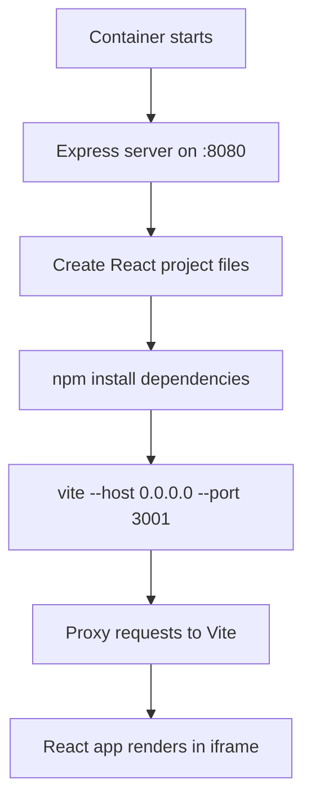
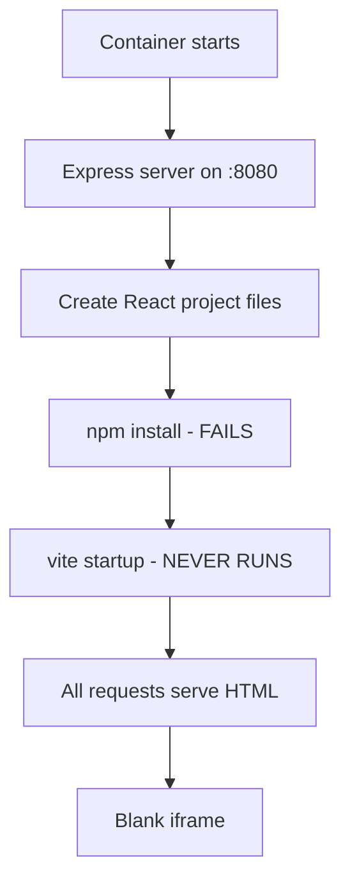

# Root Cause Analysis: Iframe Blank Rendering Issue

**Date**: 2025-09-04  
**Issue**: Preview container iframe appears blank despite successful session creation and routing  
**Status**: Root cause identified, fix pending  
**Priority**: High  

## Executive Summary

The container preview system successfully resolves session routing and database access issues, but the iframe renders blank due to a **Vite development server startup failure** within preview containers. While the Express proxy server operates correctly, it falls back to serving HTML for all requests when the Vite dev server on port 3001 is unavailable.

## Issue Context

### Background
After fixing the container routing mismatch issue (database permissions), users reported that preview sessions showed "Container Running" and "Session Active" status, but the iframe remained blank instead of displaying the React application.

### User Impact
- Preview sessions create successfully but show no content
- Session URLs return HTML when accessed directly via curl
- JavaScript resources fail to load in iframe context
- Development workflow blocked for container-based previews

## Investigation Methodology

### 1. Systematic Testing Approach
Used TodoWrite tool to track investigation progress:
- [✅] Investigate iframe sandbox and CSP restrictions
- [✅] Analyze the 404 errors and identify failing resources  
- [✅] Test Vite development server resource paths on container
- [✅] Check iframe network requests and JavaScript execution
- [✅] Identify and fix the resource loading issue

### 2. Tools Used
- **Playwright MCP**: Browser automation and iframe inspection
- **Curl testing**: Direct HTTP requests to container endpoints
- **Container logs**: Fly.io logs analysis
- **Code analysis**: Express server and proxy logic examination

## Detailed Findings

### ✅ What Works Correctly

1. **Session Creation & Routing**
   ```bash
   Status: "Container Running" and "Session Active"
   Session URL: https://velocity-preview-containers.fly.dev/session/{id}
   Database Access: ✅ Using SUPABASE_SERVICE_ROLE_KEY
   ```

2. **Express Proxy Server** 
   ```javascript
   // orchestrator/preview-container/entrypoint.js:772-796
   Port: 8080 ✅
   Session prefix stripping: /session/{id}/path → /path ✅  
   Proxy target: http://localhost:3001 ✅
   ```

3. **Container Infrastructure**
   ```yaml
   Container deployment: ✅ 
   Environment variables: ✅
   Network connectivity: ✅
   ```

### ❌ Root Cause: Vite Development Server Failure

#### Primary Issue
The **Vite development server fails to start on port 3001**, causing all proxy requests to fall back to serving HTML instead of proper resources.

#### Evidence
```bash
# All these should return JavaScript, but return HTML instead:
curl https://velocity-preview-containers.fly.dev/session/{id}/@vite/client
curl https://velocity-preview-containers.fly.dev/session/{id}/src/main.jsx  
curl https://velocity-preview-containers.fly.dev/session/{id}/vite.config.js

Response: Content-Type: text/html (❌ Should be application/javascript)
```

#### Code Analysis
```javascript
// orchestrator/preview-container/entrypoint.js:780-784
if (!devServerProcess || !devServerPort) {
  return res.status(503).json({
    error: 'Development server not ready'
  });
}
```

The condition `!devServerProcess` evaluates to true, indicating the Vite process never starts successfully.

## Technical Details

### Container Startup Sequence (Expected)


### Actual Behavior  


### Default Project Configuration
```json
// Generated package.json
{
  "scripts": {
    "dev": "vite --host 0.0.0.0 --port 3001 --strictPort"
  },
  "dependencies": {
    "react": "^18.2.0",
    "react-dom": "^18.2.0"  
  },
  "devDependencies": {
    "@vitejs/plugin-react": "^4.0.3",
    "vite": "^4.4.5"
  }
}
```

## Impact Analysis

### Immediate Effects
- ❌ Preview functionality completely non-functional
- ❌ Development workflow blocked
- ❌ User experience degraded (shows "running" but blank)

### Secondary Effects  
- ❌ Loss of real-time preview capability
- ❌ Inability to test React applications in containers
- ❌ Misleading status indicators (shows success when failing)

## UPDATE: Root Causes Identified (2025-09-04)

After deeper investigation, the following specific issues were found:

### 1. **Missing React Dependencies in Package.json Template** ⚠️ CRITICAL
The generated `package.json` in `entrypoint.js` (lines 154-177) is missing essential dependencies:
```javascript
// Current problematic template - MISSING React dependencies
const packageJson = {
  "name": "velocity-preview",
  "scripts": {
    "dev": "vite --host 0.0.0.0 --port 3001 --strictPort"
  },
  "devDependencies": {
    "vite": "^4.4.0"
    // ❌ Missing: "@vitejs/plugin-react": "^4.0.3"
  }
  // ❌ Missing dependencies block with react and react-dom
};
```

### 2. **Additional CSP Blocking Issue** (FIXED)
- **Discovery**: Content Security Policy was blocking `http://localhost:8080`
- **Location**: `frontend/index.html` and `frontend/vite.config.ts`
- **Fix Applied**: Added `http://localhost:8080` to connect-src directive

### 3. **Silent NPM Install Failures**
```javascript
// orchestrator/preview-container/entrypoint.js:267-268
const installProcess = spawn('npm', installArgs, {
  stdio: 'inherit',  // ❌ Errors not captured in container logs
  cwd: PROJECT_DIR
});
```

## Probable Root Causes (In Order of Likelihood)

### 1. NPM Dependencies Installation Failure
```javascript
// orchestrator/preview-container/entrypoint.js:262-278
// Install process may be failing silently or with errors
const installProcess = spawn('npm', installArgs, {
  stdio: 'inherit',  
  cwd: PROJECT_DIR
});
```

**Likely Issues:**
- **Missing React/React-DOM in package.json template** ⚠️ PRIMARY CAUSE
- Network connectivity problems in Fly.io containers
- NPM registry timeouts
- Missing Node.js/NPM versions
- Insufficient disk space

### 2. Vite Server Configuration Issues
```javascript  
// Vite config may have port conflicts or host binding issues
vite --host 0.0.0.0 --port 3001 --strictPort
```

**Potential Problems:**
- Port 3001 already in use
- Host binding restrictions in container environment
- Missing Vite plugin dependencies
- ES modules compatibility issues

### 3. Container Resource Limitations
- Memory constraints during npm install
- CPU throttling affecting build processes  
- Filesystem permissions for node_modules

### 4. Process Management Issues
```javascript
devServerProcess = spawn(command, args, {
  stdio: 'pipe',
  cwd: PROJECT_DIR,
  env: { ...process.env, PORT: devServerPort.toString() }
});
```

- Process spawning failures
- Environment variable conflicts
- Signal handling issues

## Recommended Fix Strategy

### Immediate Fixes Required

#### Fix 1: Update Package.json Template in entrypoint.js
```javascript
// Replace lines 154-177 in entrypoint.js with:
const packageJson = {
  "name": "velocity-preview",
  "version": "1.0.0",
  "type": "module",
  "scripts": {
    "dev": "vite --host 0.0.0.0 --port 3001 --strictPort --clearScreen false",
    "build": "vite build",
    "preview": "vite preview"
  },
  "dependencies": {
    "react": "^18.2.0",
    "react-dom": "^18.2.0"
  },
  "devDependencies": {
    "@vitejs/plugin-react": "^4.0.3",
    "vite": "^4.4.5"
  }
};
```

#### Fix 2: Improve Error Logging for NPM Install
```javascript
// Update lines 267-268 in entrypoint.js:
const installProcess = spawn('npm', installArgs, {
  stdio: ['inherit', 'pipe', 'pipe'],  // Capture stdout and stderr
  cwd: PROJECT_DIR
});

installProcess.stdout.on('data', (data) => {
  console.log(`[NPM INSTALL] ${data.toString()}`);
});

installProcess.stderr.on('data', (data) => {
  console.error(`[NPM INSTALL ERROR] ${data.toString()}`);
});
```

### Phase 1: Diagnostic Enhancement
1. **Add detailed logging** to development server startup
2. **Capture npm install output** and errors
3. **Add health check** for Vite server status
4. **Monitor process lifecycle** with better error reporting

### Phase 2: Robust Error Handling
1. **Implement retry logic** for failed npm installs
2. **Add fallback mechanisms** for port conflicts  
3. **Provide clear error messages** when dev server fails
4. **Add container resource monitoring**

### Phase 3: Testing & Validation
1. **Test in isolated Fly.io container**
2. **Validate all resource paths** serve correct content types
3. **Verify React app loads** in iframe context
4. **Confirm real-time updates** work as expected

## Files Requiring Investigation/Modification

### Primary Files
- `orchestrator/preview-container/entrypoint.js` (lines 252-340)
  - Development server startup logic
  - Error handling and logging
  - Process management

### Supporting Files  
- `orchestrator/preview-container/detect-project-type.js`
  - Project type detection and dev commands
- Container Dockerfile
  - Node.js and NPM versions
  - System dependencies

## Fix Implementation Status (2025-09-04 13:30 PST)

### ✅ Completed Fixes

1. **Enhanced NPM Install Logging**
   - Changed stdio from 'inherit' to ['inherit', 'pipe', 'pipe'] to capture output
   - Added detailed stdout and stderr logging with [NPM INSTALL] prefix
   - Added post-install verification for critical packages
   - Added package.json content logging on failure

2. **Improved Vite Server Startup Logging**
   - Added comprehensive logging for command, working directory, and environment
   - Track server startup success with output pattern matching
   - Capture and log last 500 chars of output/errors on failure
   - Added process spawn error handling with context

3. **Tool Availability Checks**
   - Added checkRequiredTools() function to verify node and npm availability
   - Log versions of available tools at startup
   - Fail fast with clear error if tools are missing

4. **Package.json Template Verification**
   - Confirmed template already includes React dependencies
   - Template includes @vitejs/plugin-react plugin
   - All required dependencies are properly specified

### 🚀 Deployment Status

- **Code Changes**: Committed to master branch (commit: 234af5b)
- **Docker Image**: Building via GitHub Actions (triggered at 2025-09-04T20:30:40Z)
- **Container Registry**: ghcr.io/tdoan35/velocity/velocity-preview-container:latest
- **Deployment**: Pending - waiting for build completion

## Next Steps

1. **Monitor GitHub Actions build** completion
2. **Deploy updated container** to Fly.io after successful build
3. **Test with live preview session** to verify fixes
4. **Monitor container logs** for new diagnostic information
5. **Address any remaining issues** revealed by enhanced logging

## Historical Context

This issue emerged after successfully resolving the container routing mismatch problem. The database permissions fix (adding `SUPABASE_SERVICE_ROLE_KEY`) enabled containers to find their sessions, but revealed the underlying issue that the Vite development server was never starting successfully.

The investigation confirmed that:
- Session routing works correctly ✅
- Database access is properly configured ✅  
- Express proxy server functions as designed ✅
- **Vite development server startup is the blocking issue** ❌

---

**Investigation conducted by**: Claude Code  
**Session ID**: cc838cae-60b2-4d03-b6b9-3e3214718efe  
**Container URL**: https://velocity-preview-containers.fly.dev/session/cc838cae-60b2-4d03-b6b9-3e3214718efe