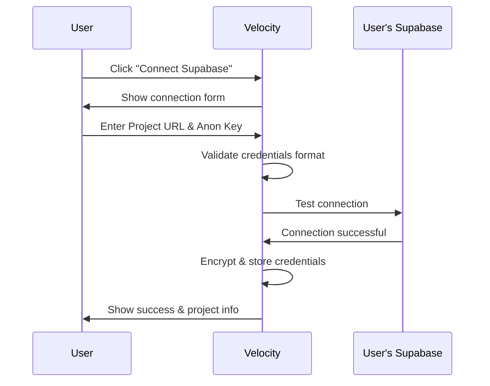

# Supabase Direct Connection Setup Guide

## Overview
This guide explains how to set up Supabase direct connection for Velocity, allowing users to connect their own existing Supabase projects to provide backend capabilities for their applications. Each user brings their own Supabase backend by providing their project credentials, giving them full control over their data and infrastructure without requiring OAuth or partner registration.

## Architecture
```
┌─────────────────┐
│  Velocity App   │
│   (Frontend)    │
└────────┬────────┘
         │
    OAuth Flow
         │
         ▼
┌─────────────────┐     ┌─────────────────┐
│ User's Supabase │     │ User's Supabase │
│   Project #1    │     │   Project #2    │
│  - Database     │     │  - Database     │
│  - Auth         │     │  - Auth         │
│  - Storage      │     │  - Storage      │
│  - Edge Funcs   │     │  - Edge Funcs   │
└─────────────────┘     └─────────────────┘
```

Each user connects their own Supabase project, maintaining complete control and isolation.

## Benefits of OAuth Integration

### For Users
- **Full Control**: Users own their backend infrastructure
- **Data Sovereignty**: Complete control over their data
- **Custom Configuration**: Users can customize their Supabase project
- **Direct Access**: Users can access Supabase dashboard directly
- **Cost Transparency**: Users manage their own Supabase billing

### For Platform
- **Scalability**: No shared resource limitations
- **Reduced Liability**: Users manage their own data
- **Lower Costs**: No need to provision backend for all users
- **Flexibility**: Users can upgrade their Supabase plans independently

## Prerequisites

### For Velocity Platform
1. Secure credential storage implementation
2. Environment variables for encryption keys
3. HTTPS connection for secure credential transmission

### For Users
1. Must have a Supabase account
2. Must have at least one Supabase project
3. Must have their project URL and anon key available

## Setup Steps

### 1. User Connection Flow

Users connect their Supabase projects by providing:
1. **Project URL**: The Supabase project URL (e.g., `https://xxxxx.supabase.co`)
2. **Anon Key**: The public anonymous key from their project settings
3. **Optional Service Role Key**: For advanced operations (stored encrypted)

These credentials are obtained from the user's Supabase dashboard:
- Navigate to Project Settings → API
- Copy the Project URL
- Copy the `anon` public key
- Optionally copy the `service_role` key for admin operations

### 2. Configure Environment Variables

#### Development (.env.local)
```env
# Velocity's own Supabase project (for user auth and app data)
VITE_SUPABASE_URL=https://your-velocity-project.supabase.co
VITE_SUPABASE_ANON_KEY=your-velocity-anon-key

# Encryption for storing user credentials
CREDENTIAL_ENCRYPTION_KEY=your-32-byte-encryption-key
CREDENTIAL_ENCRYPTION_IV=your-16-byte-iv

# Feature flag for Supabase connections
VITE_SUPABASE_DIRECT_CONNECTION_ENABLED=true
```

#### Production (.env.production)
```env
# Velocity's Supabase project
VITE_SUPABASE_URL=https://your-velocity-project.supabase.co
VITE_SUPABASE_ANON_KEY=your-velocity-anon-key

# Encryption for storing user credentials (use secure key management in production)
CREDENTIAL_ENCRYPTION_KEY=${CREDENTIAL_ENCRYPTION_KEY}
CREDENTIAL_ENCRYPTION_IV=${CREDENTIAL_ENCRYPTION_IV}

# Feature flag for Supabase connections
VITE_SUPABASE_DIRECT_CONNECTION_ENABLED=true
```

### 3. Database Setup

Run the connection storage migration on your Velocity Supabase project:

```bash
# Using Supabase CLI
npx supabase migration up

# Or apply directly via SQL Editor:
# supabase/migrations/20250122000001_supabase_direct_connection.sql
```

This creates:
- `supabase_connections` table - Stores encrypted user credentials
- `connection_tests` table - Logs connection test results
- Project columns for Supabase integration
- RLS policies for secure access

### 4. Connection Flow Implementation

#### Direct Connection Flow


#### Key Implementation Points

1. **Credential Validation**:
```typescript
// Validate Supabase project URL format
const isValidUrl = (url: string) => {
  const pattern = /^https:\/\/[a-z0-9]+\.supabase\.co$/;
  return pattern.test(url);
};

// Validate anon key format
const isValidAnonKey = (key: string) => {
  // Supabase anon keys are JWT tokens
  const parts = key.split('.');
  return parts.length === 3;
};
```

2. **Connection Testing**:
```typescript
// Test connection to user's Supabase project
import { createClient } from '@supabase/supabase-js';

const testConnection = async (url: string, anonKey: string) => {
  try {
    const client = createClient(url, anonKey);
    // Try a simple query to verify connection
    const { data, error } = await client.from('_test').select('*').limit(1);
    if (error && error.code !== 'PGRST116') { // Table not found is ok
      throw error;
    }
    return { success: true };
  } catch (error) {
    return { success: false, error };
  }
};
```

3. **Credential Storage**:
```typescript
// Store encrypted credentials
await supabase.from('supabase_connections').insert({
  user_id: userId,
  project_id: projectId,
  supabase_url: encryptData(projectUrl),
  supabase_anon_key: encryptData(anonKey),
  connection_status: 'connected',
  last_tested: new Date()
});
```

### 5. Security Implementation

#### Credential Encryption
```typescript
import { createCipheriv, createDecipheriv, randomBytes } from 'crypto';

// Encrypt credentials before storage
function encryptData(data: string): string {
  const iv = randomBytes(16);
  const cipher = createCipheriv('aes-256-gcm', ENCRYPTION_KEY, iv);
  let encrypted = cipher.update(data, 'utf8', 'hex');
  encrypted += cipher.final('hex');
  const authTag = cipher.getAuthTag();
  return iv.toString('hex') + ':' + authTag.toString('hex') + ':' + encrypted;
}

// Decrypt credentials for use
function decryptData(encrypted: string): string {
  const parts = encrypted.split(':');
  const iv = Buffer.from(parts[0], 'hex');
  const authTag = Buffer.from(parts[1], 'hex');
  const encryptedData = parts[2];
  
  const decipher = createDecipheriv('aes-256-gcm', ENCRYPTION_KEY, iv);
  decipher.setAuthTag(authTag);
  
  let decrypted = decipher.update(encryptedData, 'hex', 'utf8');
  decrypted += decipher.final('utf8');
  return decrypted;
}
```

#### Security Best Practices
- Never store credentials in plain text
- Use strong encryption (AES-256-GCM)
- Validate all user inputs
- Test connections before storing
- Implement rate limiting on connection attempts
- Audit log all connection activities

### 6. User Experience Flow

1. **Project Design Page**:
   - User sees "Connect Supabase" button
   - Click opens connection modal
   - Success enables "Build" button

2. **Connection Modal**:
   - User enters their Supabase project URL
   - User enters their anon key
   - Optional: User enters service role key
   - Click "Test Connection"

3. **Connection Validation**:
   - Velocity validates credential format
   - Tests connection to Supabase
   - Shows success or error message
   - Stores encrypted credentials on success

4. **Connection Management**:
   - Display connected project info
   - Show connection status
   - Allow disconnect/reconnect
   - Enable backend features

## API Endpoints

### Test Connection
```http
POST /api/supabase/test-connection
Content-Type: application/json
Authorization: Bearer <user-token>

{
  "project_url": "https://xxxxx.supabase.co",
  "anon_key": "eyJhbGc..."
}

Response:
{
  "success": true,
  "project_info": {
    "url": "https://xxxxx.supabase.co",
    "connected": true,
    "timestamp": "2024-01-01T00:00:00Z"
  }
}
```

### Save Connection
```http
POST /api/supabase/connect
Content-Type: application/json
Authorization: Bearer <user-token>

{
  "velocity_project_id": "velocity-project-id",
  "project_url": "https://xxxxx.supabase.co",
  "anon_key": "eyJhbGc...",
  "service_role_key": "eyJhbGc..." // Optional
}

Response:
{
  "success": true,
  "connection_id": "conn-id"
}
```

### Get Connection Status
```http
GET /api/supabase/connection/:project_id
Authorization: Bearer <user-token>

Response:
{
  "connected": true,
  "project_url": "https://xxxxx.supabase.co",
  "last_tested": "2024-01-01T00:00:00Z",
  "status": "active"
}
```

### Disconnect Project
```http
DELETE /api/supabase/connection/:project_id
Authorization: Bearer <user-token>

Response:
{
  "success": true,
  "message": "Supabase connection removed"
}
```

## Testing

### Local Development
1. Set up test Supabase project:
```bash
# Create a test project at supabase.com
# Get the project URL and anon key
```

2. Test connection flow
3. Verify credential encryption/decryption
4. Test connection persistence

### Integration Testing
```typescript
describe('Supabase Direct Connection', () => {
  it('should validate project URL format', () => {
    const validUrl = 'https://abcdef.supabase.co';
    const invalidUrl = 'https://example.com';
    expect(isValidUrl(validUrl)).toBe(true);
    expect(isValidUrl(invalidUrl)).toBe(false);
  });

  it('should validate anon key format', () => {
    const validKey = 'eyJhbGciOiJIUzI1NiIsInR5cCI6IkpXVCJ9.eyJpc3MiOiJzdXBhYmFzZSJ9.abc';
    const invalidKey = 'not-a-jwt';
    expect(isValidAnonKey(validKey)).toBe(true);
    expect(isValidAnonKey(invalidKey)).toBe(false);
  });

  it('should encrypt and decrypt credentials', () => {
    const original = 'https://test.supabase.co';
    const encrypted = encryptData(original);
    const decrypted = decryptData(encrypted);
    expect(decrypted).toBe(original);
  });

  it('should test connection successfully', async () => {
    const result = await testConnection(testUrl, testKey);
    expect(result.success).toBe(true);
  });
});
```

## Troubleshooting

### Common Issues

#### "Invalid project URL" error
- Ensure URL follows format: `https://xxxxx.supabase.co`
- No trailing slashes
- Must be HTTPS
- Check for typos in the project reference

#### "Invalid anon key" error
- Key must be a valid JWT token
- Check you're copying the `anon` key, not `service_role`
- Ensure no extra spaces or line breaks

#### "Connection failed" error
- Verify the project is active
- Check network connectivity
- Ensure anon key matches the project
- Try testing in Supabase dashboard first

#### Credentials not persisting
- Check encryption keys are set
- Verify database write permissions
- Check RLS policies on connections table

### Debug Mode
Enable connection debug logging:
```env
VITE_DEBUG_CONNECTIONS=true
VITE_LOG_LEVEL=debug
```

## Monitoring

### Key Metrics
- Connection success rate
- Average time to connect
- Connection test success rate
- Error rates by type

### Alerts
- Connection success rate < 95%
- Connection test failures > 10%
- Encryption/decryption errors
- Database write failures

## Best Practices

### Security
- Always use HTTPS in production
- Encrypt tokens at rest
- Implement token rotation
- Regular security audits
- Monitor for suspicious activity

### User Experience
- Clear error messages
- Progress indicators during OAuth
- Allow disconnection/reconnection
- Show connection status clearly
- Provide help documentation

### Performance
- Cache project lists
- Implement token refresh preemptively
- Use connection pooling
- Optimize database queries
- Background token refresh

## Support Resources

- [Supabase OAuth Documentation](https://supabase.com/docs/guides/platform/oauth)
- [OAuth 2.0 Security Best Practices](https://datatracker.ietf.org/doc/html/draft-ietf-oauth-security-topics)
- [Velocity Support](mailto:support@velocity.app)

## Next Steps

After successful setup:
1. ✅ Test complete OAuth flow
2. ✅ Implement token refresh automation
3. ✅ Add project management features
4. ✅ Set up monitoring and alerts
5. ✅ Create user documentation