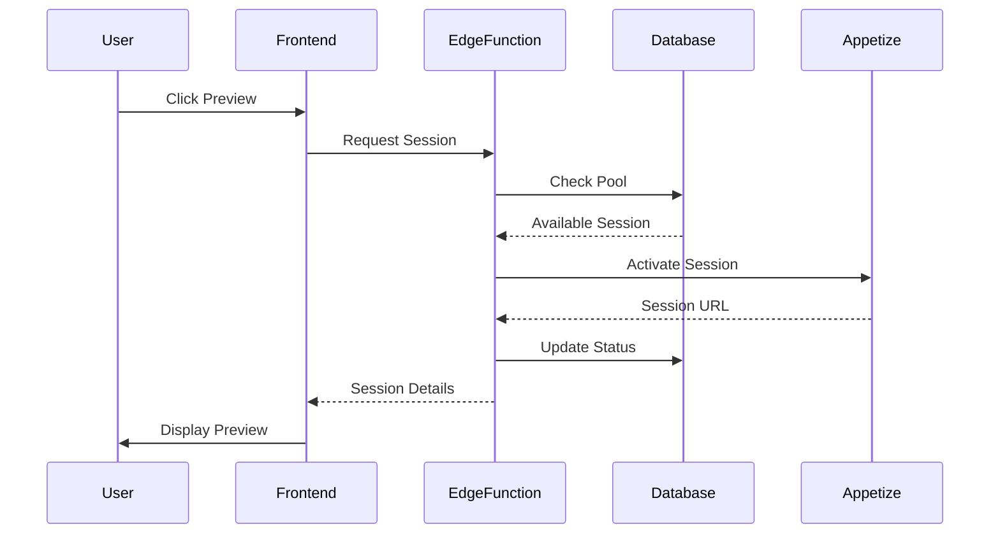
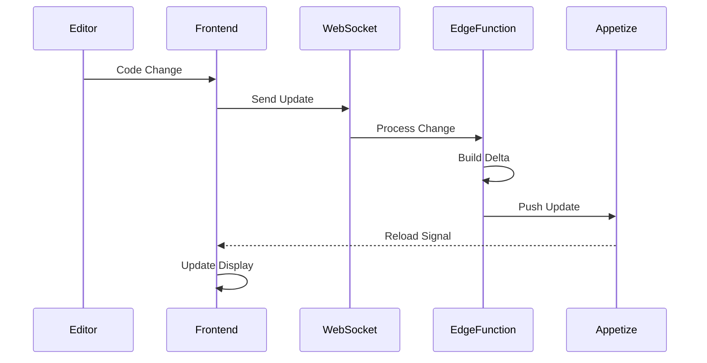

# Preview System Architecture

## Overview

The Velocity Preview System is a sophisticated real-time mobile application preview platform built on modern cloud-native technologies. It provides instant, interactive previews of React Native applications on real iOS and Android devices through the browser.

## System Architecture Diagram

```
┌─────────────────┐     ┌──────────────────┐     ┌─────────────────┐
│                 │     │                  │     │                 │
│  React Frontend │────▶│  Edge Functions  │────▶│  Appetize.io    │
│  (Browser)      │◀────│  (Supabase)      │◀────│  (Device Cloud) │
│                 │     │                  │     │                 │
└────────┬────────┘     └────────┬─────────┘     └─────────────────┘
         │                       │
         │                       ▼
         │              ┌─────────────────┐
         │              │                 │
         └─────────────▶│  PostgreSQL     │
          WebSocket     │  (Supabase)     │
                        │                 │
                        └─────────────────┘
```

## Core Components

### 1. Frontend Layer

#### React Components
- **MobilePreview.tsx**: Main preview container component
- **PreviewControls.tsx**: Device controls and interaction interface
- **PreviewErrorBoundary.tsx**: Error handling and recovery UI
- **PerformanceMonitor.tsx**: Real-time performance metrics display

#### State Management
- **useAppetizePreview.ts**: Core preview state and lifecycle management
- **useHotReload.ts**: WebSocket-based hot reload functionality
- **usePreviewOptimization.ts**: Performance optimization hooks
- **usePreviewDiagnostics.ts**: Diagnostic and debugging tools

#### Services
- **sessionPoolService.ts**: Preview session lifecycle management
- **previewSelfHealingService.ts**: Automatic error recovery
- **performanceTrackingService.ts**: Metrics collection and analysis

### 2. Backend Layer (Supabase Edge Functions)

#### Core Functions

##### preview-session
Manages preview session lifecycle:
```typescript
- POST /create - Creates new preview sessions
- GET /{id} - Retrieves session information
- PUT /{id}/update - Updates session state
- DELETE /{id} - Terminates sessions
```

##### build-preview
Handles application building and bundling:
```typescript
- POST /build - Initiates build process
- GET /status/{id} - Check build status
- POST /hot-reload - Handles incremental updates
```

##### preview-optimizer
Performance optimization engine:
```typescript
- POST /warm-sessions - Pre-warms session pool
- POST /optimize-build - Build optimization
- POST /adaptive-quality - Dynamic quality adjustment
```

##### preview-diagnostics
Error handling and diagnostics:
```typescript
- POST /report-error - Error reporting
- GET /health-check - System health status
- GET /diagnostic-report - Generate diagnostic reports
```

### 3. Database Layer

#### Core Tables

```sql
-- Preview Sessions
preview_sessions
├── id (UUID)
├── public_id (string)
├── user_id (FK → auth.users)
├── project_id (FK → projects)
├── appetize_session_id
├── status (enum)
├── device_info (JSONB)
└── created_at/updated_at

-- Session Pool
preview_session_pool
├── id (UUID)
├── device_type
├── os_type
├── quality_tier
├── status (enum)
└── allocated_to (FK → preview_sessions)

-- Performance Metrics
performance_metrics
├── id (UUID)
├── session_id
├── metric_type
├── value
├── metadata (JSONB)
└── created_at

-- Error Logs
preview_error_logs
├── id (UUID)
├── error_code
├── severity
├── context (JSONB)
├── recovery_steps (array)
└── created_at
```

### 4. External Integration Layer

#### Appetize.io Integration
- Real device simulation
- iOS and Android support
- WebSocket streaming
- Interactive controls API

## Data Flow

### 1. Session Creation Flow



### 2. Hot Reload Flow



## Security Architecture

### Authentication & Authorization
- Supabase Auth integration
- Row Level Security (RLS) policies
- API key management
- Session token validation

### Data Protection
- End-to-end encryption for sensitive data
- Secure WebSocket connections (WSS)
- API rate limiting
- Input validation and sanitization

## Performance Architecture

### Optimization Strategies

1. **Session Pool Management**
   - Pre-warmed sessions for instant access
   - Predictive allocation based on usage patterns
   - Automatic scaling based on demand

2. **Build Optimization**
   - Incremental builds for hot reload
   - Distributed caching system
   - Parallel processing for multi-file changes

3. **Network Optimization**
   - WebSocket connection pooling
   - Compression for data transfer
   - CDN integration for static assets

### Monitoring & Metrics

```typescript
interface PerformanceMetrics {
  sessionStartupTime: number;
  buildTime: number;
  hotReloadTime: number;
  networkLatency: number;
  framerate: number;
  memoryUsage: number;
}
```

## Scalability Design

### Horizontal Scaling
- Stateless Edge Functions
- Database connection pooling
- Load balancing across regions

### Vertical Scaling
- Auto-scaling policies
- Resource allocation optimization
- Performance tier management

## Reliability Features

### Self-Healing Mechanisms
1. Automatic session recovery
2. Connection retry with exponential backoff
3. Fallback device selection
4. Cache invalidation strategies

### Error Recovery Strategies
```typescript
enum RecoveryStrategy {
  RETRY_WITH_BACKOFF = 'retry_with_backoff',
  RECREATE_SESSION = 'recreate_session',
  CLEAR_CACHE = 'clear_cache',
  RECONNECT_WEBSOCKET = 'reconnect_websocket',
  REFRESH_AUTH = 'refresh_auth',
  FALLBACK_DEVICE = 'fallback_device',
  REDUCE_QUALITY = 'reduce_quality'
}
```

## Integration Points

### CI/CD Integration
- GitHub Actions support
- Preview on pull requests
- Automated testing hooks

### Development Tools
- VS Code extension support
- Chrome DevTools integration
- React Developer Tools compatibility

## Future Architecture Considerations

### Planned Enhancements
1. Multi-region deployment
2. Edge computing for reduced latency
3. AI-powered performance optimization
4. Blockchain-based usage tracking

### Extensibility
- Plugin architecture for custom features
- Webhook system for external integrations
- GraphQL API for advanced queries
- SDK for third-party developers

## Technical Stack

- **Frontend**: React 18, TypeScript, Tailwind CSS
- **Backend**: Supabase Edge Functions (Deno)
- **Database**: PostgreSQL with pgvector
- **Real-time**: Supabase Realtime (WebSockets)
- **Device Cloud**: Appetize.io
- **Monitoring**: Custom metrics with Supabase
- **CDN**: Cloudflare (future)

## Architecture Principles

1. **Separation of Concerns**: Clear boundaries between layers
2. **Scalability First**: Designed for horizontal scaling
3. **Resilience**: Self-healing and graceful degradation
4. **Performance**: Optimized for sub-second interactions
5. **Security**: Defense in depth approach
6. **Observability**: Comprehensive logging and monitoring

---

For implementation details, see the [API Reference](./api-reference.md) and [Edge Functions Guide](./edge-functions.md).